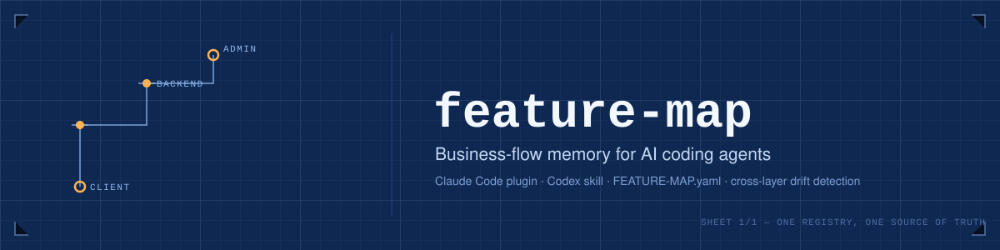
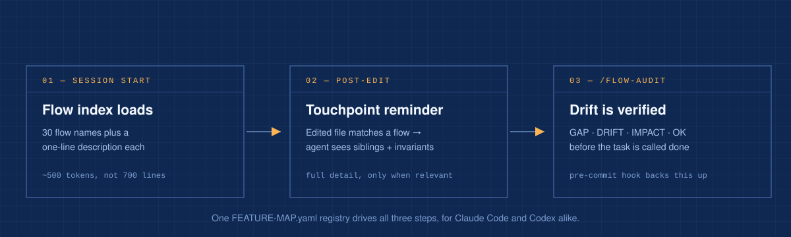

<div align="center">



# feature-map

### Cross-layer business-flow mapping for Claude Code &amp; Codex

**Stop AI coding agents from editing one side of a business rule and forgetting the other.**
`feature-map` is a `FEATURE-MAP.yaml` registry, a Claude Code plugin, and a Codex skill that
keep client, backend, admin, docs, and migration touchpoints of the same flow in sync —
with proactive session context, post-edit reminders, and a `GAP`/`DRIFT`/`IMPACT`/`OK` audit.

[](#releases)
[](#claude-code-usage)
[](#codex-usage)
[](#quick-example)

<p>
  <a href="#english"><strong>English</strong></a>
  ·
  <a href="#bahasa-indonesia"><strong>Bahasa Indonesia</strong></a>
</p>

</div>

---

## English

`feature-map` helps Claude Code and Codex keep cross-layer business behavior consistent. It maps the files that belong to the same business flow, reminds the agent when one touchpoint changes, and gives you an audit path before silent drift becomes a production bug.

Most code tools understand imports, callers, and symbols. Real product bugs often live somewhere else:

- a mobile form changed, but backend validation did not
- an admin approval page still shows the old status
- API docs promise a field that the service no longer accepts
- a payment rule changed, but reporting, notifications, and migration logic stayed behind

`feature-map` exists for that semantic layer.

### Available For

| Agent | Status | What it can do |
| --- | --- | --- |
| Claude Code | Available | Native plugin commands, PostToolUse reminders, pre-commit sync checks |
| Codex | Available | Skill adapter, flow audit workflow, registry helpers, shared source of truth |

The Claude plugin and Codex skill use the same `FEATURE-MAP.yaml` registry, so one project map can guide both agents.

### What It Does

- **Declares business flows** in `FEATURE-MAP.yaml`
- **Connects touchpoints** across UI, backend, services, docs, database migrations, and event consumers
- **Tracks invariants** that must stay consistent across those touchpoints
- **Marks flows stale** when a mapped file changes
- **Audits drift** with `GAP`, `DRIFT`, `IMPACT`, `RULE-GAP`, and `OK` findings
- **Flags undocumented business rules** by cross-checking test-touchpoint descriptions against declared invariants
- **Imports blueprint/FRD/SRS documents** into draft flow maps with page evidence
- **Supports multi-repo flows** through a local repo registry
- **Follows impact chains** with declared `impacts`
- **Uses call-graph blast radius** when `.code-review-graph/graph.db` is present

### How It Works



### Why This Matters

AI agents are fast, but speed can widen the gap between files that should change together. `feature-map` gives agents a lightweight memory of the product's business logic, not just the code graph.

The goal is simple:

> When one part of a business flow changes, the rest of the flow should not be forgotten.

This plugin is meant to grow into a shared safety layer for AI-assisted engineering: small enough to install anywhere, explicit enough to review in Git, and practical enough to help during real edits.

### Quick Example

```yaml
flows:
  partner-registration:
    description: "Partner signs up, gets validated, and is reviewed by admin"
    policy: "KTP is required before partner verification can be approved"
    touchpoints:
      - path: "mobile/**/PartnerRegistrationForm.*"
        role: client-form
      - path: "api/**/PartnerRegistrationController.*"
        role: backend-validation
      - path: "admin/**/PartnerVerificationPage.*"
        role: admin-view
      - path: "docs/api/partner-registration.md"
        role: docs
    invariants:
      - "KTP required/optional status must match client, backend, admin, and docs"
      - "Verification status values must be consistent across API and admin UI"
```

If an agent edits the mobile form, `feature-map` reminds it to inspect backend validation, admin verification, and API docs before calling the task done.

### Claude Code Usage

**Install from GitHub** (recommended — works for anyone, no local clone needed):

```bash
claude plugin marketplace add ade-syofyan/feature-map
claude plugin install feature-map@feature-map
```

**Install for local development** (if you cloned this repo to hack on the plugin itself):

```bash
git clone https://github.com/ade-syofyan/feature-map.git
claude plugin marketplace add ./feature-map
claude plugin install feature-map@feature-map
```

Either path registers the same marketplace name (`feature-map`, from `.claude-plugin/marketplace.json`), so every command below works the same way regardless of which install method you used.

All commands are namespaced under the plugin name — `/feature-map:<command>`, not just `/<command>` — since a bare command name can collide with other installed plugins.

Initialize a project:

```text
/feature-map:flow-map-init
```

Generate a draft map from a blueprint, FRD, SRS, SOP, or workflow document:

```text
/feature-map:flow-map-from-doc docs/blueprint.pdf FEATURE-MAP.draft.yaml
```

Audit stale flows:

```text
/feature-map:flow-audit
```

Audit one flow:

```text
/feature-map:flow-audit partner-registration
```

Register a related repo for multi-repo flows:

```text
/feature-map:flow-repo-register backend-api
```

Install the pre-commit hook:

```text
/feature-map:flow-sync-install
```

It has two independent behaviors: a non-blocking warning when a flow changes on one role/layer but not the others (path heuristic, prone to false positives), and a **blocking** check (exit 1) when a flow touched by the current commit has pending business-rule drift not yet synced into `FEATURE-MAP.yaml` — run `/feature-map:flow-sync-apply` first, or override with `FEATURE_MAP_ACK=1 git commit ...` when the change genuinely isn't a business-rule change. The block only ever applies to flows whose touchpoints are part of the current commit, so unrelated or stale pending entries never hold up unrelated work.

Without `FEATURE-MAP.yaml`, the hooks are a no-op and safe to keep installed globally.

### Codex Usage

`feature-map` also ships with a Codex skill adapter. Codex has no plugin marketplace, so install it by cloning and syncing the skill folder directly:

```bash
git clone https://github.com/ade-syofyan/feature-map.git
cd feature-map
rsync -a --delete codex-skill/feature-map/ ~/.codex/skills/feature-map/
chmod +x ~/.codex/skills/feature-map/scripts/feature_map_cli.py
```

Re-run the `rsync` command whenever you `git pull` an update — Codex reads only from `~/.codex/skills/feature-map/`, not from the cloned repo.

Then ask Codex naturally:

```text
Use feature-map to audit stale flows in this repo.
```

Useful helper commands:

```bash
~/.codex/skills/feature-map/scripts/feature_map_cli.py status .
~/.codex/skills/feature-map/scripts/feature_map_cli.py repo-register my-service
~/.codex/skills/feature-map/scripts/feature_map_cli.py mark-clean . partner-registration
```

For blueprint imports in Codex, use the same CLI:

```bash
~/.codex/skills/feature-map/scripts/feature_map_cli.py import-doc docs/blueprint.pdf -o FEATURE-MAP.draft.yaml
```

### Findings

Audits classify results as:

- **GAP**: real inconsistency that can cause broken behavior
- **DRIFT**: registry, docs, or implementation no longer describe the same truth
- **IMPACT**: another flow is affected through declared impact or call graph
- **RULE-GAP**: a test description encodes a business rule that no invariant reflects
- **OK**: invariant was checked and is consistent

### Catching Rules Before They Go Stale

`FEATURE-MAP.yaml` invariants are hand-written, so they drift behind the actual business logic — especially edge cases (a specific role excluded from a warning, a value computed from one source instead of another) that show up first as a regression test, not as a registry update. `/feature-map:flow-audit` cross-checks a flow's test touchpoints against its invariants: it extracts test description strings (`it('does not explain missing nrp for office monthly rows', ...)`), and flags ones whose content words barely overlap the declared invariants:

```bash
python3 ${CLAUDE_PLUGIN_ROOT}/hooks/fm_rules_check.py <repo-root> <flow>
```

This is a keyword heuristic, not a verdict — a flagged test may already be covered by an invariant phrased differently. It surfaces candidates for human review, the same way `confidence: draft` does for blueprint imports.

### Releases

#### v0.10.0 - Blocking Drift Gate & Flow History Log

- `precommit_check.py` now **blocks** the commit (exit 1) when a flow touched by the staged files has pending business-rule drift not yet synced into `FEATURE-MAP.yaml` — a stronger signal than the existing cross-role path warning, since it's only raised after the PostToolUse hook already detected a formula/condition change. Scoped strictly to flows whose touchpoints are part of the current commit, so unrelated or orphaned pending entries (e.g. a flow later renamed or removed from the registry) never block unrelated work. Override with `FEATURE_MAP_ACK=1 git commit ...`, same escape hatch pattern as `--no-verify`.
- Adds an optional `last_reviewed` field per flow (date + short commit SHA), set automatically by `/feature-map:flow-sync-apply` whenever it syncs that flow's invariants/policy — a quick "was this consciously reviewed" marker for whoever picks up the flow later.
- Adds an optional `history` field per flow: an append-only log of `date`/`sha`/`author`/`change` entries, one per sync, so anyone taking over the project can see exactly what changed, from what to what, who did it, and when — without digging through `git log` across every touchpoint file.
- Both new fields are populated in the same `Edit` call `/feature-map:flow-sync-apply` already makes to update invariants — no new confirmation mechanism, the existing edit-approval prompt stays the only review gate.
- Born from wanting a guard against business-flow changes an editor doesn't realize they're making, while keeping changes the editor does consciously make (and records) safe to proceed.

#### v0.9.2 - Fix: Throttle Marker Leaking Into Pending List

- v0.9.1's session-throttle marker (`.stop-reminded-<session_id>.json`) was written inside `.claude/feature-map-pending/`, the same directory `fm_pending.load_all_pending()` scans for `*.json` pending-drift files — so the marker got read back as if it were a pending flow named `.stop-reminded-<session_id>`, defeating the throttle and polluting the reminder message
- The marker now lives in a separate `.claude/feature-map-state/` directory (gitignored), which `load_all_pending()` never touches

#### v0.9.1 - Stop Hook Reminder Throttling

- The Stop hook now reminds about each pending-drift flow at most once per session (tracked in a session marker file, see v0.9.2 for where) instead of re-printing the same `additionalContext` message on every single Stop event while the drift stays unresolved — the old behavior read as the agent spamming the same reminder turn after turn
- A flow drops out of the "already reminded" set the moment its pending entry is cleared (synced or dismissed via `/feature-map:flow-sync-apply`), so genuinely new drift on that flow still surfaces normally

#### v0.9.0 - Semi-Automatic Drift Sync

- The PostToolUse reminder now also captures what changed to `.claude/feature-map-pending/<flow>.json` (file, role, tool, diff, current policy/invariants) — no hook or script ever writes to `FEATURE-MAP.yaml` or calls a model; this is just a durable capture of context for later summarization
- A new Stop hook fires at the end of the turn if any flow has unsynced pending drift, reminding the agent to run `/feature-map:flow-sync-apply` — non-blocking, advisory only, and now throttled to once per flow per session (see v0.9.1)
- `/feature-map:flow-sync-apply` (new command) reads the pending drift, judges whether it's an actual business-rule change or just a refactor/rename, drafts the new/revised invariant or policy for real changes, and applies it with the normal `Edit` tool — the existing edit-approval prompt is the review gate, there's no separate confirmation flow
- Codex gets the same capability via two new `feature_map_cli.py` subcommands (`pending-status`, `pending-clear`) and `references/flow-sync-apply.md`, since Codex has no PostToolUse/Stop hooks to trigger this automatically — it's told to check pending drift itself before finishing a task
- Why this exists: unlike `code-review-graph`'s mechanical re-index, `FEATURE-MAP.yaml` invariants are narrative prose — summarizing a diff into a correct invariant needs judgment a hook script can't provide, so the write step always goes through the agent, never a hook

#### v0.8.0 - Mechanics Docs & Formula-Change Detection

- Adds an optional `mechanics_doc` field per flow: a path to a companion markdown doc for business rules too complex for a one-line invariant (many modes/variants, a formula with several conditions, many exceptions) — full narrative, real numeric examples, comparison tables
- `PostToolUse` reminder now includes a lightweight heuristic, `detect_formula_change()`: scans newly written code for assignment/return lines that combine an arithmetic operator with a business keyword (total, threshold, sanksi, tarif, komisi, etc.) and flags them explicitly, instead of relying on a generic "update FEATURE-MAP.yaml if policy changed" line that's easy to miss mid-task
- `/feature-map:flow-audit` (Claude command and Codex reference) now reads and cross-checks `mechanics_doc` against the actual code, reporting `DRIFT` when the doc and implementation disagree
- Born from a real incident: a multi-mode attendance-recap formula (default vs. sales, Sanksi vs. Tidak Hadir, per-position exceptions, partner/mitra-type rules) shipped six related bug fixes across one session before anyone thought to check whether the registry's one-line invariants still matched — this release makes that check proactive instead of relying on the user asking

#### v0.7.0 - Rule-Gap Detection from Tests

- Adds `hooks/fm_rules_check.py`: extracts test description strings from a flow's test touchpoints (Pest `it()`/`test()`, PHPUnit method names) and flags ones whose content words barely overlap the flow's declared invariants
- Adds `RULE-GAP` as a new `/feature-map:flow-audit` finding category, run automatically when a flow has test touchpoints
- Adds `feature_map_cli.py rules-check <flow>` for the same check from Codex
- Born from a real incident: a `refund-batch-allocation` flow had accurate touchpoints but invariants too narrow to cover role-specific edge cases (a value computed from one source instead of another, one role excluded from a warning) that were already encoded in regression tests — this closes that class of gap going forward

#### v0.6.0 - Proactive SessionStart Index

- Adds a `SessionStart` hook that prints a lightweight index (flow name + one-line description only, no touchpoints/invariants) whenever a project has `FEATURE-MAP.yaml`
- Lets the agent know which business flows exist *before* editing anything, instead of only finding out reactively via the `PostToolUse` reminder after a touchpoint file was already changed
- Full flow detail (touchpoints, invariants) is still deferred to the existing `PostToolUse` hook to keep the SessionStart context small

#### v0.5.1 - Full-Coverage Init

- `/flow-map-init` now requires enumerating every entrypoint module (controllers, route groups, services, Livewire/screens) as an explicit checklist before drafting, instead of sampling "3-5 most critical" flows
- Removes the skip-if-single-layer shortcut: every business-flow module must get a registry entry (single-layer or cross-layer), unless it's pure non-business infrastructure
- Draft summary now reports checklist coverage (modules found vs. flows registered) so gaps are visible instead of silently dropped

#### v0.5.0 - Blueprint Importer

- Adds `/flow-map-from-doc` for blueprint, FRD, SRS, SOP, and workflow documents
- Generates draft `FEATURE-MAP.yaml` entries with `confidence: draft`
- Adds `evidence` metadata with document source, page, and section
- Produces placeholder implementation paths that can later be bound to real code
- Parses blueprint metadata in the hook parser without breaking existing maps

#### v0.4.0 - Impact Chain & Call Graph

- Added `impacts` for transitive flow impact tracking
- Marks downstream flows stale with `via:<flow>`
- Shows impact chains in reminders
- Integrates with `code-review-graph` for call-graph blast radius
- Reports undeclared cross-flow effects as **IMPACT**
- Adds Codex skill adapter support

#### v0.3.0 - Multi-Repo Flow

- Added `repo: <name>` touchpoints
- Added local registry at `~/.claude/feature-maps/registry.json`
- Added repo register/list/remove command
- Audits touchpoints across registered repos
- Reports missing repo mappings as `UNRESOLVED`

#### v0.2.0 - Stale Flow Detection

- Marks changed flows stale in `.feature-map/state.json`
- Adds non-blocking pre-commit warning hook
- Makes `/flow-audit` incremental by default
- Advances `last_synced_sha` after clean audits

### Schema Notes

The hook parser intentionally supports a small YAML subset without external dependencies. Avoid YAML anchors, multiline scalars, and complex nested structures. Keep the registry boring, explicit, and reviewable.

Supported touchpoint roles:

- `client-form`
- `client-view`
- `backend-validation`
- `backend-service`
- `admin-view`
- `docs`
- `db-migration`
- `event-consumer`

### Roadmap

- Better Codex-native workflow helpers
- Safer registry validation and formatting
- More examples for Laravel, mobile apps, monorepos, and service meshes
- Richer audit output for pull requests
- Better integration with code-review-graph and other dependency analyzers
- Portable installer for Claude + Codex in one command

### Contributing

Contributors are welcome.

Good first contributions:

- example `FEATURE-MAP.yaml` files from real project shapes
- better docs for multi-repo teams
- tests for tricky YAML subset cases
- improvements to Codex skill behavior
- integrations with other graph or review tools
- clearer audit report formats

The hope is for `feature-map` to become a practical shared language between humans and AI agents: product rules in one place, mapped to the code that must honor them.

If this idea matches a bug your team has seen before, open an issue, propose a flow pattern, or send a PR.

---

## Bahasa Indonesia

`feature-map` membantu Claude Code dan Codex menjaga konsistensi perilaku bisnis lintas layer. Plugin ini memetakan file-file yang berada dalam flow bisnis yang sama, mengingatkan agent saat salah satu touchpoint berubah, dan memberi jalur audit sebelum drift diam-diam menjadi bug production.

Banyak tool kode paham import, caller, dan symbol. Tapi bug produk sering muncul di lapisan lain:

- form mobile berubah, tapi validasi backend tidak ikut
- halaman approval admin masih membaca status lama
- dokumentasi API menjanjikan field yang service sudah tidak terima
- aturan pembayaran berubah, tapi reporting, notifikasi, dan migration tertinggal

`feature-map` dibuat untuk lapisan semantik itu.

### Tersedia Untuk

| Agent | Status | Kemampuan |
| --- | --- | --- |
| Claude Code | Tersedia | Command plugin native, reminder PostToolUse, pre-commit sync check |
| Codex | Tersedia | Skill adapter, flow audit workflow, helper registry, source of truth yang sama |

Plugin Claude dan skill Codex memakai registry `FEATURE-MAP.yaml` yang sama, jadi satu peta project bisa membimbing kedua agent.

### Fungsi Utama

- **Mendeklarasikan flow bisnis** di `FEATURE-MAP.yaml`
- **Menghubungkan touchpoint** lintas UI, backend, service, docs, migration database, dan event consumer
- **Mencatat invariant** yang harus konsisten antar touchpoint
- **Menandai flow stale** saat file yang dipetakan berubah
- **Mengaudit drift** dengan temuan `GAP`, `DRIFT`, `IMPACT`, `RULE-GAP`, dan `OK`
- **Menandai rule bisnis yang belum terdokumentasi** dengan cross-check deskripsi test touchpoint terhadap invariant yang sudah ada
- **Mengimpor dokumen blueprint/FRD/SRS** menjadi draft flow map dengan evidence halaman
- **Mendukung multi-repo flow** melalui registry repo lokal
- **Mengikuti rantai dampak** lewat field `impacts`
- **Memakai blast radius call-graph** saat `.code-review-graph/graph.db` tersedia

### Cara Kerjanya


### Kenapa Ini Penting

AI agent cepat, tapi kecepatan bisa memperlebar jarak antara file-file yang seharusnya berubah bersama. `feature-map` memberi agent memori ringan tentang logika bisnis produk, bukan hanya graph kode.

Tujuannya sederhana:

> Saat satu bagian flow bisnis berubah, bagian lain dari flow itu tidak boleh terlupakan.

Plugin ini diarahkan menjadi safety layer bersama untuk engineering berbantuan AI: kecil untuk dipasang di mana saja, eksplisit untuk direview di Git, dan cukup praktis untuk membantu saat edit nyata.

### Contoh Cepat

```yaml
flows:
  partner-registration:
    description: "Partner mendaftar, divalidasi, lalu direview admin"
    policy: "KTP wajib sebelum verifikasi partner bisa disetujui"
    touchpoints:
      - path: "mobile/**/PartnerRegistrationForm.*"
        role: client-form
      - path: "api/**/PartnerRegistrationController.*"
        role: backend-validation
      - path: "admin/**/PartnerVerificationPage.*"
        role: admin-view
      - path: "docs/api/partner-registration.md"
        role: docs
    invariants:
      - "Status wajib/opsional KTP harus sama di client, backend, admin, dan docs"
      - "Nilai status verifikasi harus konsisten antara API dan admin UI"
```

Jika agent mengubah form mobile, `feature-map` akan mengingatkan agent untuk memeriksa validasi backend, halaman verifikasi admin, dan dokumentasi API sebelum task dianggap selesai.

### Penggunaan Claude Code

**Install dari GitHub** (rekomendasi — jalan untuk siapa saja, tidak perlu clone manual):

```bash
claude plugin marketplace add ade-syofyan/feature-map
claude plugin install feature-map@feature-map
```

**Install untuk pengembangan lokal** (kalau kamu clone repo ini untuk mengutak-atik plugin-nya sendiri):

```bash
git clone https://github.com/ade-syofyan/feature-map.git
claude plugin marketplace add ./feature-map
claude plugin install feature-map@feature-map
```

Kedua cara mendaftarkan nama marketplace yang sama (`feature-map`, dari `.claude-plugin/marketplace.json`), jadi semua command di bawah bekerja sama saja apa pun cara install-nya.

Semua command memakai namespace nama plugin — `/feature-map:<command>`, bukan cuma `/<command>` — karena nama command polos bisa bentrok dengan plugin lain yang terpasang.

Inisialisasi project:

```text
/feature-map:flow-map-init
```

Buat draft map dari dokumen blueprint, FRD, SRS, SOP, atau workflow:

```text
/feature-map:flow-map-from-doc docs/blueprint.pdf FEATURE-MAP.draft.yaml
```

Audit flow yang stale:

```text
/feature-map:flow-audit
```

Audit satu flow:

```text
/feature-map:flow-audit partner-registration
```

Daftarkan repo terkait untuk multi-repo flow:

```text
/feature-map:flow-repo-register backend-api
```

Pasang pre-commit hook:

```text
/feature-map:flow-sync-install
```

Ada dua perilaku independen: warning non-blocking kalau satu flow berubah di satu role/layer tapi role lain tidak ikut (heuristik path, rawan false-positive), dan pengecekan **blocking** (exit 1) kalau flow yang tersentuh commit saat ini punya drift aturan bisnis yang belum disinkronkan ke `FEATURE-MAP.yaml` — jalankan `/feature-map:flow-sync-apply` dulu, atau override dengan `FEATURE_MAP_ACK=1 git commit ...` kalau perubahannya memang bukan aturan bisnis. Blocking ini cuma berlaku untuk flow yang touchpoint-nya memang ada di commit saat ini, jadi entry pending yang lama/tidak berhubungan tidak pernah menghambat kerja lain.

Tanpa `FEATURE-MAP.yaml`, hook-nya tidak melakukan apa-apa, jadi aman dipasang global.

### Penggunaan Codex

`feature-map` juga membawa adapter skill Codex. Codex tidak punya konsep plugin marketplace, jadi install-nya dengan clone lalu sync folder skill langsung:

```bash
git clone https://github.com/ade-syofyan/feature-map.git
cd feature-map
rsync -a --delete codex-skill/feature-map/ ~/.codex/skills/feature-map/
chmod +x ~/.codex/skills/feature-map/scripts/feature_map_cli.py
```

Jalankan ulang command `rsync` di atas setiap kali kamu `git pull` update terbaru — Codex cuma baca dari `~/.codex/skills/feature-map/`, bukan dari repo hasil clone.

Lalu minta Codex secara natural:

```text
Use feature-map to audit stale flows in this repo.
```

Command helper yang berguna:

```bash
~/.codex/skills/feature-map/scripts/feature_map_cli.py status .
~/.codex/skills/feature-map/scripts/feature_map_cli.py repo-register my-service
~/.codex/skills/feature-map/scripts/feature_map_cli.py mark-clean . partner-registration
```

Untuk import blueprint di Codex, pakai CLI yang sama:

```bash
~/.codex/skills/feature-map/scripts/feature_map_cli.py import-doc docs/blueprint.pdf -o FEATURE-MAP.draft.yaml
```

### Jenis Temuan

Audit mengklasifikasikan hasil sebagai:

- **GAP**: inkonsistensi nyata yang bisa menyebabkan behavior rusak
- **DRIFT**: registry, docs, atau implementasi tidak lagi menyatakan kebenaran yang sama
- **IMPACT**: flow lain terdampak melalui deklarasi impact atau call graph
- **RULE-GAP**: deskripsi test mengandung rule bisnis yang tidak tercermin di invariant manapun
- **OK**: invariant sudah diperiksa dan konsisten

### Menangkap Rule Sebelum Jadi Stale

Invariant di `FEATURE-MAP.yaml` ditulis manual, jadi gampang tertinggal dari logika bisnis sebenarnya — terutama edge case (satu role yang dikecualikan dari warning, nilai yang dihitung dari sumber tertentu bukan sumber lain) yang biasanya lebih dulu muncul sebagai regression test, bukan update registry. `/feature-map:flow-audit` cross-check touchpoint test sebuah flow terhadap invariant-nya: mengekstrak deskripsi test (`it('does not explain missing nrp for office monthly rows', ...)`), lalu menandai yang kata-katanya nyaris tidak overlap dengan invariant yang sudah dideklarasikan:

```bash
python3 ${CLAUDE_PLUGIN_ROOT}/hooks/fm_rules_check.py <repo-root> <flow>
```

Ini heuristik kata kunci, bukan vonis final — test yang ditandai bisa saja sudah tercakup invariant yang cuma beda kata. Fungsinya memunculkan kandidat untuk direview manusia, sama seperti `confidence: draft` untuk hasil import blueprint.

### Rilis

#### v0.10.0 - Blocking Drift Gate & Riwayat Historis Flow

- `precommit_check.py` sekarang **memblokir** commit (exit 1) kalau flow yang tersentuh file yang di-stage punya drift aturan bisnis yang belum disinkronkan ke `FEATURE-MAP.yaml` — sinyal yang lebih kuat daripada warning cross-role path yang sudah ada, karena baru muncul setelah hook PostToolUse mendeteksi perubahan rumus/kondisi. Dibatasi ketat hanya ke flow yang touchpoint-nya memang ada di commit saat ini, jadi entry pending yang tidak berhubungan atau sudah yatim (mis. flow yang belakangan di-rename/dihapus dari registry) tidak pernah memblokir kerja lain. Override dengan `FEATURE_MAP_ACK=1 git commit ...`, pola yang sama seperti `--no-verify`.
- Menambahkan field opsional `last_reviewed` per flow (tanggal + short SHA commit), diisi otomatis oleh `/feature-map:flow-sync-apply` tiap kali menyinkronkan invariant/policy flow tsb — penanda cepat "sudah direview secara sadar" untuk siapa pun yang pegang flow ini nanti.
- Menambahkan field opsional `history` per flow: log append-only berisi entry `date`/`sha`/`author`/`change`, satu per sinkronisasi, supaya siapa pun yang ambil alih project bisa lihat persis apa yang berubah, dari apa jadi apa, siapa pelakunya, dan kapan — tanpa harus menelusuri `git log` di tiap file touchpoint.
- Kedua field baru ini diisi di Edit call yang sama yang sudah dilakukan `/feature-map:flow-sync-apply` untuk update invariant — tidak ada mekanisme konfirmasi baru, prompt approval Edit yang sudah ada tetap satu-satunya review gate.
- Lahir dari kebutuhan penjagaan terhadap perubahan flow bisnis yang tidak disadari oleh yang mengedit, sekaligus tetap membiarkan perubahan yang memang disadari (dan dicatat) tetap aman untuk lanjut.

#### v0.9.2 - Fix: Marker Throttle Ikut Kebaca Sebagai Pending

- Marker throttle sesi dari v0.9.1 (`.stop-reminded-<session_id>.json`) sebelumnya ditulis di dalam `.claude/feature-map-pending/`, folder yang sama yang dipindai `fm_pending.load_all_pending()` untuk file `*.json` pending-drift — akibatnya marker itu ikut terbaca seolah flow pending bernama `.stop-reminded-<session_id>`, throttle-nya jadi tidak berfungsi dan pesan reminder ikut kotor
- Marker sekarang disimpan di folder terpisah `.claude/feature-map-state/` (di-gitignore), yang tidak pernah disentuh `load_all_pending()`

#### v0.9.1 - Throttle Reminder Hook Stop

- Hook `Stop` sekarang cuma mengingatkan tiap flow dengan drift tertunda maksimal satu kali per sesi (dilacak di marker sesi, lihat v0.9.2 untuk lokasi terbarunya), bukan mencetak ulang `additionalContext` yang sama persis di setiap Stop event selama drift-nya belum diselesaikan — perilaku lama itu keliatan seperti agent nge-spam reminder yang sama berkali-kali
- Sebuah flow keluar dari daftar "sudah diingatkan" begitu entry pending-nya dihapus (disinkronkan atau di-dismiss lewat `/feature-map:flow-sync-apply`), jadi drift baru yang genuine pada flow itu tetap muncul normal

#### v0.9.0 - Sinkronisasi Drift Semi-Otomatis

- Reminder `PostToolUse` sekarang juga menyimpan konteks perubahan ke `.claude/feature-map-pending/<flow>.json` (file, role, tool, diff, policy/invariant saat ini) — tidak ada hook atau script yang menulis ke `FEATURE-MAP.yaml` atau memanggil model; ini cuma penyimpanan konteks yang tahan lama untuk dirangkum belakangan
- Hook `Stop` baru muncul di akhir turn kalau ada flow dengan drift belum disinkronkan, mengingatkan agent untuk menjalankan `/feature-map:flow-sync-apply` — non-blocking, sifatnya cuma saran, dan sekarang di-throttle jadi sekali per flow per sesi (lihat v0.9.1)
- `/feature-map:flow-sync-apply` (command baru) membaca drift tertunda, menilai apakah itu perubahan aturan bisnis atau cuma refactor/rename, merangkum invariant/policy baru untuk perubahan nyata, lalu menerapkannya lewat tool `Edit` biasa — prompt persetujuan Edit yang sudah ada itu sendiri jadi review gate-nya, tidak ada mekanisme konfirmasi terpisah
- Codex dapat kemampuan yang sama lewat dua subcommand baru di `feature_map_cli.py` (`pending-status`, `pending-clear`) dan `references/flow-sync-apply.md`, karena Codex tidak punya hook PostToolUse/Stop untuk memicu ini otomatis — Codex diinstruksikan mengecek drift tertunda sendiri sebelum menyelesaikan task
- Alasannya: berbeda dari re-index mekanis `code-review-graph`, invariant di `FEATURE-MAP.yaml` adalah prosa naratif — merangkum diff jadi invariant yang benar butuh judgment yang tidak bisa diberikan script hook, jadi langkah menulisnya selalu lewat agent, bukan hook

#### v0.8.0 - Dokumen Cara Main & Deteksi Perubahan Rumus

- Menambahkan field opsional `mechanics_doc` per flow: path ke markdown pelengkap untuk aturan bisnis yang terlalu kompleks untuk satu baris invariant (banyak mode/varian, rumus dengan beberapa kondisi, banyak pengecualian) — narasi lengkap, contoh angka nyata, tabel perbandingan
- Reminder `PostToolUse` sekarang punya heuristik ringan, `detect_formula_change()`: scan kode yang baru ditulis untuk baris assignment/return yang menggabungkan operator aritmatika dengan kata kunci bisnis (total, threshold, sanksi, tarif, komisi, dll) dan menandainya secara eksplisit — bukan cuma mengandalkan baris generik "update FEATURE-MAP.yaml kalau policy berubah" yang gampang kelewat di tengah task
- `/feature-map:flow-audit` (command Claude dan referensi Codex) sekarang membaca dan cross-check `mechanics_doc` terhadap kode sebenarnya, melaporkan `DRIFT` kalau dokumen dan implementasi tidak sinkron
- Lahir dari insiden nyata: rumus rekap presensi multi-mode (default vs sales, Sanksi vs Tidak Hadir, pengecualian per jabatan, aturan tipe mitra) menghasilkan enam bug fix terkait dalam satu sesi sebelum ada yang kepikiran cek apakah invariant satu-baris di registry masih cocok — rilis ini bikin pengecekan itu proaktif, bukan menunggu user bertanya

#### v0.7.0 - Deteksi Rule-Gap dari Test

- Menambahkan `hooks/fm_rules_check.py`: mengekstrak deskripsi test dari touchpoint test sebuah flow (Pest `it()`/`test()`, nama method PHPUnit), lalu menandai yang kata-katanya nyaris tidak overlap dengan invariant yang dideklarasikan
- Menambahkan `RULE-GAP` sebagai kategori temuan baru `/feature-map:flow-audit`, otomatis jalan kalau flow punya touchpoint test
- Menambahkan `feature_map_cli.py rules-check <flow>` untuk pengecekan yang sama dari Codex
- Lahir dari insiden nyata: flow `refund-batch-allocation` sudah punya touchpoint akurat, tapi invariant-nya terlalu sempit untuk edge case spesifik-role (nilai dihitung dari sumber tertentu bukan sumber lain, satu role dikecualikan dari warning) yang sebenarnya sudah terenkode di regression test — ini menutup celah jenis itu ke depannya

#### v0.6.0 - Index Proaktif saat SessionStart

- Menambahkan hook `SessionStart` yang mencetak index ringan (nama flow + deskripsi satu baris saja, tanpa touchpoints/invariants) begitu project punya `FEATURE-MAP.yaml`
- Agent jadi tahu flow bisnis apa saja yang ada *sebelum* mulai edit apa pun, bukan cuma tahu secara reaktif lewat reminder `PostToolUse` setelah file touchpoint sudah kadung diubah
- Detail flow lengkap (touchpoints, invariants) tetap ditunda ke hook `PostToolUse` yang sudah ada supaya konteks SessionStart tetap kecil

#### v0.5.1 - Cakupan Penuh saat Init

- `/flow-map-init` sekarang wajib mengenumerasi semua modul entrypoint (controller, route group, service, Livewire/screen) sebagai checklist eksplisit dulu, bukan sampling "3-5 flow paling kritis"
- Menghapus shortcut skip-kalau-satu-layer: setiap modul flow bisnis wajib punya entri registry (satu layer maupun lintas layer), kecuali murni infrastruktur non-bisnis
- Ringkasan draft sekarang melaporkan cakupan checklist (modul ditemukan vs flow terdaftar) supaya gap terlihat, bukan hilang diam-diam

#### v0.5.0 - Blueprint Importer

- Menambahkan `/flow-map-from-doc` untuk dokumen blueprint, FRD, SRS, SOP, dan workflow
- Menghasilkan draft `FEATURE-MAP.yaml` dengan `confidence: draft`
- Menambahkan metadata `evidence` berisi source dokumen, halaman, dan section
- Membuat placeholder path implementasi yang nanti bisa di-bind ke file code nyata
- Parser hook membaca metadata blueprint tanpa merusak map lama

#### v0.4.0 - Impact Chain & Call Graph

- Menambahkan `impacts` untuk tracking dampak flow secara transitif
- Menandai downstream flow stale dengan `via:<flow>`
- Menampilkan rantai dampak di reminder
- Integrasi dengan `code-review-graph` untuk blast radius call-graph
- Melaporkan dampak lintas flow yang belum dideklarasikan sebagai **IMPACT**
- Menambahkan dukungan adapter skill Codex

#### v0.3.0 - Multi-Repo Flow

- Menambahkan touchpoint `repo: <name>`
- Menambahkan registry lokal di `~/.claude/feature-maps/registry.json`
- Menambahkan command register/list/remove repo
- Audit touchpoint lintas repo terdaftar
- Melaporkan mapping repo yang hilang sebagai `UNRESOLVED`

#### v0.2.0 - Stale Flow Detection

- Menandai flow yang berubah sebagai stale di `.feature-map/state.json`
- Menambahkan pre-commit warning hook non-blocking
- Membuat `/flow-audit` incremental secara default
- Memajukan `last_synced_sha` setelah audit clean

### Catatan Skema

Parser hook sengaja hanya mendukung subset YAML kecil tanpa dependency eksternal. Hindari YAML anchor, multiline scalar, dan struktur nested kompleks. Buat registry tetap sederhana, eksplisit, dan mudah direview.

Role touchpoint yang didukung:

- `client-form`
- `client-view`
- `backend-validation`
- `backend-service`
- `admin-view`
- `docs`
- `db-migration`
- `event-consumer`

### Roadmap

- Helper workflow Codex yang lebih native
- Validasi dan formatting registry yang lebih aman
- Lebih banyak contoh untuk Laravel, mobile app, monorepo, dan service mesh
- Output audit yang lebih kaya untuk pull request
- Integrasi lebih baik dengan code-review-graph dan analyzer dependency lain
- Installer portable untuk Claude + Codex dalam satu command

### Kontribusi

Kontributor sangat diterima.

Kontribusi pertama yang cocok:

- contoh `FEATURE-MAP.yaml` dari bentuk project nyata
- dokumentasi yang lebih baik untuk team multi-repo
- test untuk edge case parser subset YAML
- peningkatan behavior skill Codex
- integrasi dengan graph atau review tool lain
- format laporan audit yang lebih jelas

Harapannya, `feature-map` menjadi bahasa bersama yang praktis antara manusia dan AI agent: aturan produk ada di satu tempat, terhubung ke kode yang wajib mematuhinya.

Kalau ide ini mirip dengan bug yang pernah terjadi di team kamu, buka issue, usulkan pola flow, atau kirim PR.
